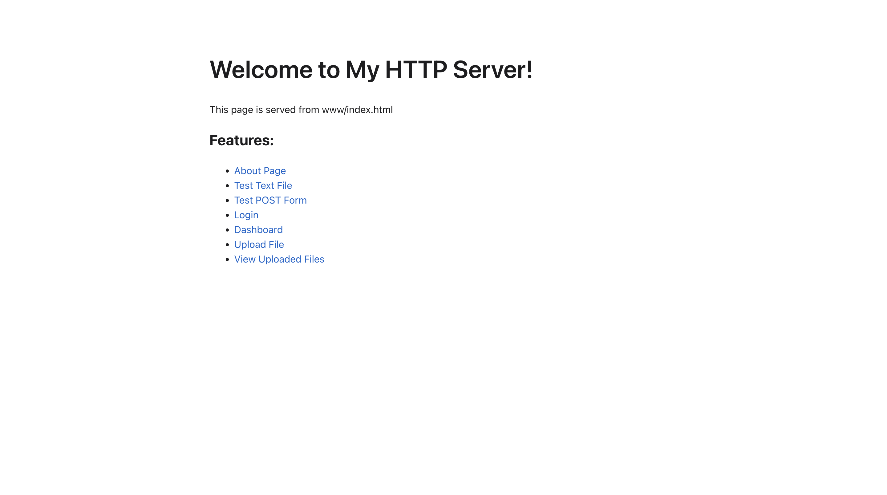
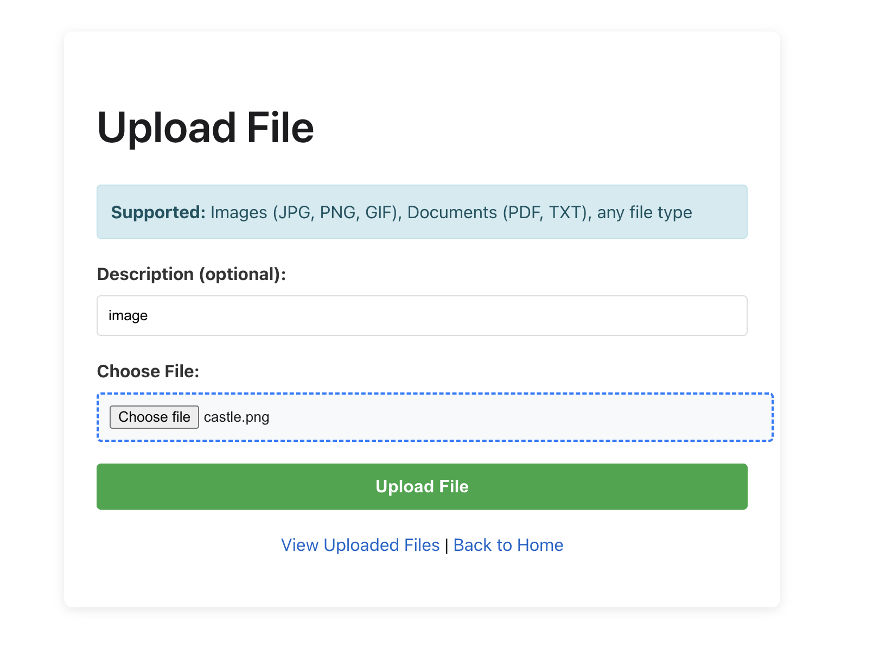
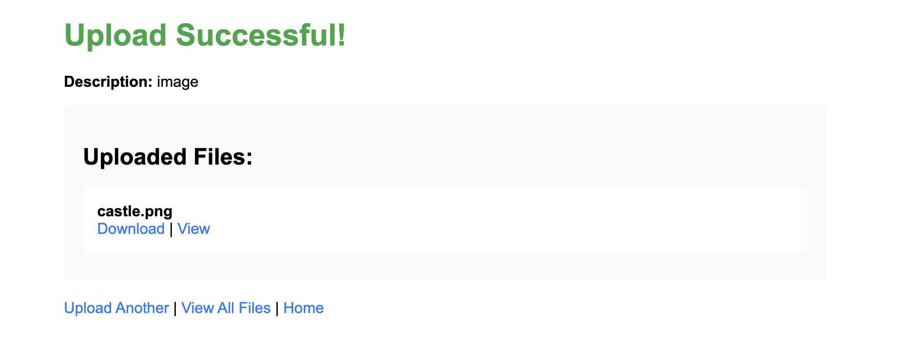
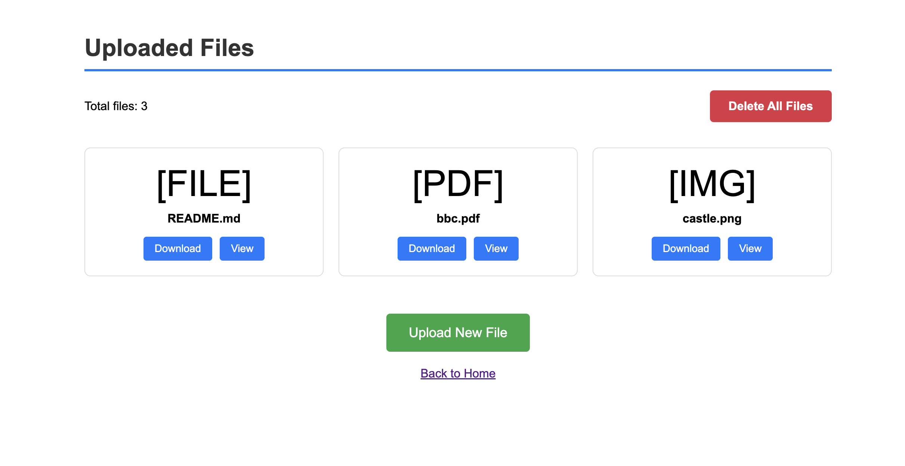
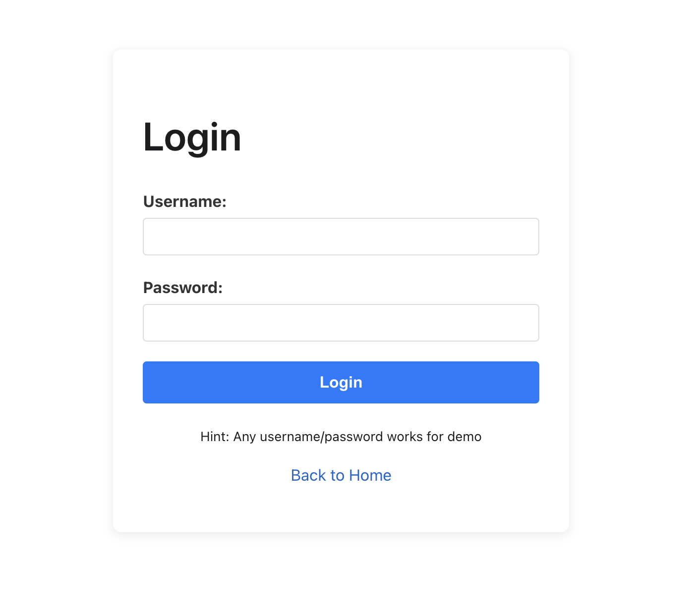
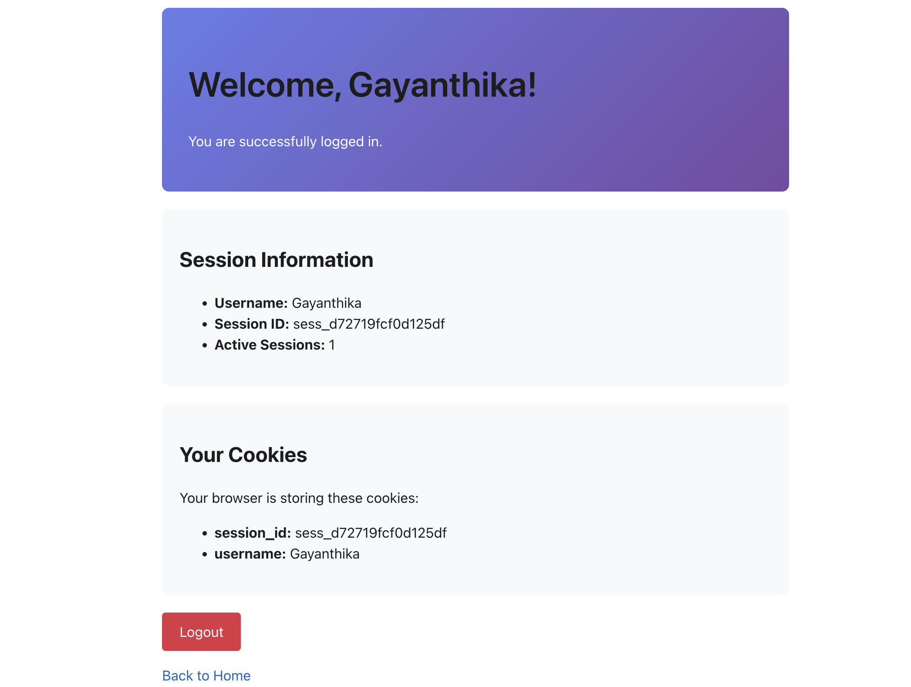

# HTTP Web Server in C++

A custom HTTP/1.1 web server built from scratch in C++. Features low-level socket programming, HTTP protocol implementation, and modern web features.

## Screenshots

### Homepage


### File Upload



### File Management


### Authentication System



### Form Processing


##  Features

### Core HTTP Functionality
-  **HTTP/1.1 Protocol** - Full implementation from scratch
- **Multiple Methods** - GET, POST, DELETE support
- **Static File Serving** - HTML, CSS, JavaScript, images, documents
- **MIME Type Detection** - Automatic content-type headers
-  **URL Encoding/Decoding** - Proper handling of special characters

### Advanced Features
-  **Session Management** - Cookie-based authentication system
-  **File Uploads** - Multipart form data parsing with binary support
- **Form Processing** - URL-encoded and multipart form handling
-  **Security** - Path traversal protection and input validation

## Quick Start

### Prerequisites
- C++11 or later
- g++ compiler
- make
- Unix-like OS (Linux, macOS)

### Installation
```bash
#Clone the repository
git clone https://github.com/YOUR_USERNAME/http-server.git
cd http-server

#Build the server
make

#Run the server
./server
```

Server will start on `http://localhost:8080`


## Usage Examples

### Basic Commands
```bash
make

#Clean build artifacts
make clean

#Rebuild from scratch
make rebuild

./server
```

### Testing Endpoints
```bash
#View homepage
curl http://localhost:8080/

#Upload a file
curl -F "description=Test" -F "file=@photo.jpg" http://localhost:8080/upload

#Submit form data
curl -X POST http://localhost:8080/submit \
  -d "name=John&email=john@example.com&message=Hello"

#Delete a file
curl -X DELETE http://localhost:8080/uploads/test.txt

#Test authentication
curl -c cookies.txt -X POST http://localhost:8080/login \
  -d "username=test&password=test"
curl -b cookies.txt http://localhost:8080/dashboard
```


## Architecture

### Project Structure
```
http-server/
├── src/
│   ├── main.cpp           #server entry point and request handling
│   ├── Socket.cpp/h       #socket wrapper class
│   ├── HttpRequest.cpp/h  
│   ├── HttpResponse.cpp/h 
│   └── Server.cpp/h       #request routing and handlers
├── www/                   
│   ├── index.html
│   ├── style.css
│   ├── upload.html
│   ├── login.html
│   └── form.html
├── uploads/               
├── docs/
│   └── screenshots/       
├── Makefile
├── README.md
├── LICENSE
└── CONTRIBUTING.md
```

### Class Diagram
```
┌─────────────┐
│   Socket    │ ← Low-level socket operations
└──────┬──────┘
       │
┌──────▼──────┐
│    main     │ ← Request reading & client handling
└──────┬──────┘
       │
       ├──► ┌──────────────┐
       │    │ HttpRequest  │ ← Parse incoming requests
       │    └──────────────┘
       │
       ├──► ┌──────────────┐
       │    │ HttpResponse │ ← Build HTTP responses
       │    └──────────────┘
       │
       └──► ┌──────────────┐
            │    Server    │ ← Route & handle requests
            └──────────────┘
```

### Request Flow
```
Client Request
     │
     ▼
Socket receives data
     │
     ▼
Parse HTTP request (HttpRequest)
     │
     ▼
Route to handler (Server)
     │
     ├─► GET    → Serve static files or dynamic routes
     ├─► POST   → Process forms or file uploads
     └─► DELETE → Remove files
     │
     ▼
Build HTTP response (HttpResponse)
     │
     ▼
Send to client (Socket)
```


##  Technical Details

### HTTP Request Parsing
- Handles both `\r\n` (CRLF) and `\n` (LF) line endings
- Supports Content-Length-based body reading
- Parses headers case-insensitively
- Extracts cookies from Cookie header

### Multipart Form Data
- Boundary detection and parsing
- Binary file content handling
- Filename extraction from Content-Disposition
- Multiple file support in single request

### Session Management
- Random session ID generation
- In-memory session storage
- Cookie expiration with Max-Age
- Secure session validation

### Security Features
- Path traversal prevention (`../` blocking)
- URL encoding validation (`%2e%2e` blocking)
- Restricted DELETE operations (uploads only)
- Safe filename sanitization


##  Supported Features

### HTTP Methods
GET
POST
DELETE

### Content Types
- `text/html`, `text/css`, `text/plain`
- `application/javascript`, `application/json`
- `image/png`, `image/jpeg`, `image/gif`
- `application/pdf`, `application/zip`


##  Testing

### Manual Testing
```bash
#Test static file serving
curl http://localhost:8080/
curl http://localhost:8080/style.css

#Test file upload
curl -F "file=@test.txt" http://localhost:8080/upload

#Test form submission
curl -X POST http://localhost:8080/submit \
  -d "name=Test&email=test@test.com&message=Hello"

#Test authentication flow
curl -c cookies.txt -X POST http://localhost:8080/login \
  -d "username=admin&password=admin"
curl -b cookies.txt http://localhost:8080/dashboard
curl -b cookies.txt http://localhost:8080/logout
```

## Known Limitations

- **Single-threaded**: Handles one request at a time (blocking I/O)
- **No HTTPS**: Plain HTTP only (no TLS/SSL support)
- **Memory-based sessions**: Sessions lost on server restart
- **No persistence**: Uploaded files remain but sessions don't
- **Basic authentication**: No password hashing or user database

## Potential Enhancements

Future improvements could include:
- Non-blocking I/O with `epoll` for concurrent connections
- HTTPS support with OpenSSL
- Database integration for user persistence
- WebSocket support for real-time features
- HTTP/2 protocol support
- Gzip compression for responses
- Rate limiting and request throttling
- Configuration file support (JSON/YAML)

## Contributing

Contributions, issues, and feature requests are welcome!

See [CONTRIBUTING.md](CONTRIBUTING.md) for guidelines.

## License

This project is licensed under the MIT License - see the [LICENSE](LICENSE) file for details.

## Learning Resources

- [RFC 2616 - HTTP/1.1 Specification](https://www.rfc-editor.org/rfc/rfc2616)
- [Beej's Guide to Network Programming](https://beej.us/guide/bgnet/)
- [MDN Web Docs - HTTP](https://developer.mozilla.org/en-US/docs/Web/HTTP)
- [C++ Reference](https://en.cppreference.com/)

